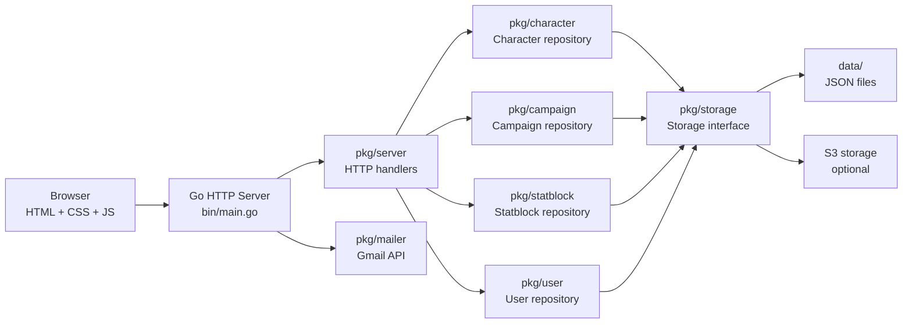
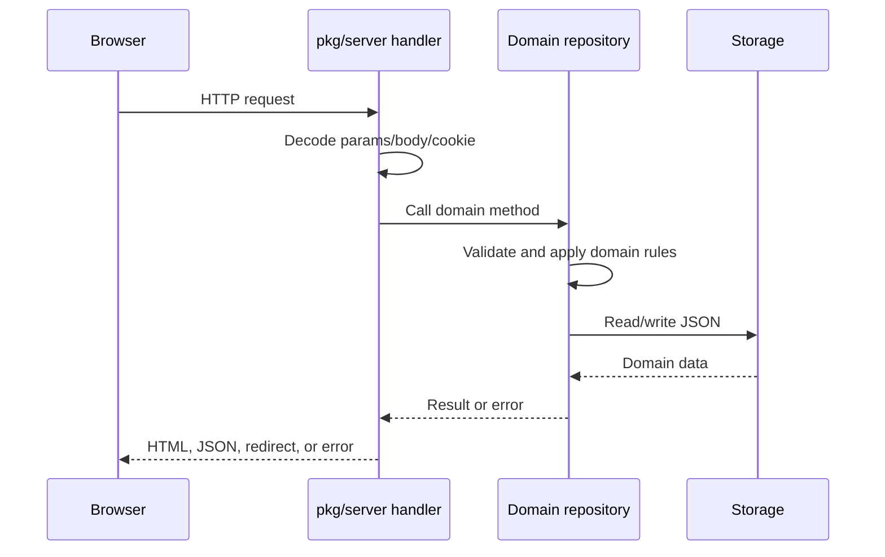
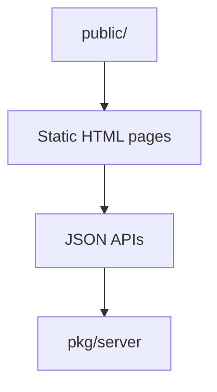
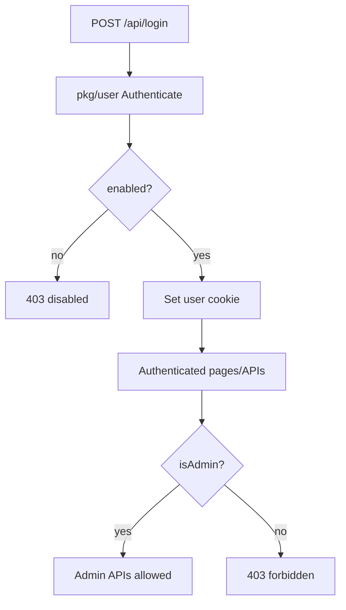
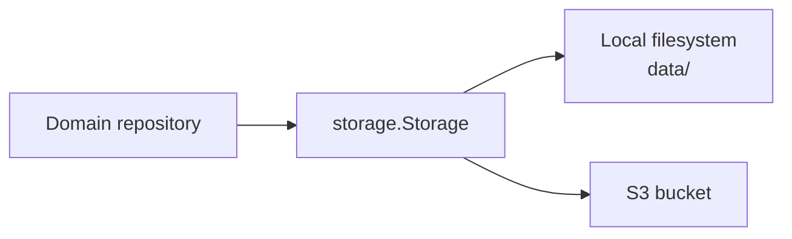

# Mythical Blue · The Great Depth

Mythical Blue is a Go HTTP server with a plain HTML, CSS, and JavaScript frontend for character sheets, campaign administration, and DM tools.

The project intentionally avoids a frontend build step. Every page is a static HTML file served from `public/`; dynamic data is loaded from JSON APIs.

## Architecture At A Glance



The important rule is that HTTP handlers do request/response work, while repositories own domain rules and persistence details.

## Main Boundaries

| Area | Location | Responsibility |
| --- | --- | --- |
| Server entrypoint | `bin/main.go` | Loads config, creates repositories, registers routes, serves `public/`, starts port `8080`. |
| HTTP handlers | `pkg/server` | Cookies, auth checks, route params, request JSON, response JSON, and redirects. |
| Character domain | `pkg/character` | Character JSON, character index, ownership, admin assignment, status updates, deletion. |
| Campaign domain | `pkg/campaign` | Campaign files, campaign list, players, DM assignment, admin campaign views, calendar state. |
| Statblock domain | `pkg/statblock` | Custom campaign statblocks. |
| User domain | `pkg/user` | Registration, login, password validation/hashing, admin flag, enabled status, profile updates. |
| Email sender | `pkg/mailer` | Sends account password-reset email through the Gmail API using OAuth refresh credentials. |
| Storage boundary | `pkg/storage` | Abstracts local filesystem and S3 object storage. |
| Frontend | `public/` | Static HTML, CSS, JavaScript, and assets. |
| Specs | `spec/` | Design notes for domains, routes, storage, and pages. |

## Request Flow



## Page Model

All pages are static HTML and fetch dynamic data from JSON APIs with JavaScript. Page identifiers and versions use query parameters rather than path segments.



## Pages

| Route | File | Notes |
| --- | --- | --- |
| `/` | `public/index.html` | Main character sheet application. |
| `/home.html` | `public/home.html` | Logged-in landing page. Shows only the current user’s characters and player campaigns, even for admins. |
| `/characters.html` | `public/characters.html` | Static character roster backed by `/api/characters?owned=1`, including strict ownership filtering for admins. |
| `/character.html?id={id}` | `public/character.html` | Static query-driven character sheet backed by the character and history APIs. |
| `/dm-screen.html` | `public/dm-screen.html` | DM tools, campaign state, initiative, custom statblocks. |
| `/login.html` | `public/login.html` | Login page. Disabled users cannot log in. |
| `/forgot-password.html` | `public/forgot-password.html` | Requests a password reset email. |
| `/reset-password.html?token={token}` | `public/reset-password.html` | Validates a reset token and sets a new password. |
| `/register.html` | `public/register.html` | Registration page. New users are disabled until an admin enables them. |
| `/admin/users.html` | `public/admin/users.html` | Static admin page for editing users, passwords, admin flag, and enabled status. |
| `/admin/characters.html` | `public/admin/characters.html` | Static admin page for viewing, assigning, unassigning, opening, and deleting characters. |
| `/admin/versions.html?id={id}` | `public/admin/versions.html` | Static admin page for browsing and previewing a character's saved versions. |
| `/admin/campaigns.html` | `public/admin/campaigns.html` | Static admin page for viewing campaigns, assigning players, and assigning or clearing the DM. |

## Auth And Admin Behavior

Authentication is cookie-based. A successful login sets the `user` cookie to the user email.

User accounts have two important flags:

- `isAdmin`: grants access to admin APIs and admin data.
- `enabled`: must be true for login. New registrations default to false.

### Password reset email setup

Password-reset email is sent through the Gmail API from one Google account. Set up OAuth once for that sending account:

1. In the [Google Cloud Console](https://console.cloud.google.com/), create or select a project.
2. Open **APIs & Services → Library**, find **Gmail API**, and enable it.
3. Set up the OAuth consent screen under **Google Auth Platform** (or **APIs & Services → OAuth consent screen**):
   - Enter the app name and support email.
   - Choose **External** for a consumer Gmail account, or **Internal** if the sender belongs to a Google Workspace organization and the app will only be used in that organization.
   - For an External app in **Testing**, add the sending Gmail address under **Test users**.
   - Under **Data Access**, add `https://www.googleapis.com/auth/gmail.send`.
4. Under **Google Auth Platform → Clients**, create an OAuth client with application type **Web application**. Add this authorized redirect URI exactly:
   `https://developers.google.com/oauthplayground`
   Save the client ID and client secret.
5. Open [OAuth 2.0 Playground](https://developers.google.com/oauthplayground/) and click the settings gear:
   - Enable **Use your own OAuth credentials** and enter the client ID and client secret from the project above.
   - Set **Access type** to **Offline**.
6. In the Playground, authorize the scope `https://www.googleapis.com/auth/gmail.send` while signed in to the sending account, then exchange the authorization code for tokens. Copy the `refresh_token` from the token response.

The refresh token allows the server to obtain short-lived access tokens for sending mail; it is reused and does not need to be changed for each email. If no refresh token appears, revoke the app under [Google Account connections](https://myaccount.google.com/connections) and repeat the offline authorization.

Supply these environment variables to the server:

- `GMAIL_CLIENT_ID`
- `GMAIL_CLIENT_SECRET`
- `GMAIL_REFRESH_TOKEN` (an offline OAuth refresh token for the sending account)
- `GMAIL_SENDER` (the authorized sender email address)
- `APP_BASE_URL` (the frontend origin used in reset links; defaults to `https://raperonzolo.com`)

For local reset-flow testing, set `APP_BASE_URL=http://localhost:8080`. Keep the client secret and refresh token in deployment secrets; never commit them to the repository. External OAuth apps left in Testing mode generally have Gmail-scope refresh tokens that expire after seven days. For ongoing production use, publish the consent configuration and complete any Google verification required for the Gmail send scope. If Google reports **Access blocked**, confirm the sender is listed as a test user and that OAuth Playground is using your own OAuth client credentials.

Admin pages are static HTML shells. The page files can be loaded directly, but the admin data and mutations are protected by admin-only API routes.



## Key API Routes

### User

| Route | Purpose |
| --- | --- |
| `GET /api/me` | Current logged-in user. |
| `PUT /api/me` | Update own name and optionally password. |
| `POST /api/login` | Authenticate and set cookie. |
| `POST /api/register` | Register a disabled-by-default user. |
| `GET /api/admin/users` | Admin user list data. |
| `PUT /api/admin/users/{id}` | Admin update of user details, password, admin flag, enabled status. |

### Character

| Route | Purpose |
| --- | --- |
| `GET /api/characters` | Character index. |
| `GET /api/characters?mine=1` | User characters, but admins receive all. |
| `GET /api/characters?owned=1` | Strictly current user’s characters, including for admins. Used by home. |
| `GET /api/characters/{id}` | Current character configuration combined with nested live state. |
| `POST /api/characters` | Save configuration and create an immutable version. |
| `POST /api/characters/{id}/copy?version={version}` | Copy current or historical configuration with the same assignment and reset live state. |
| `GET /api/characters/{id}/live` | Effective live character state. |
| `PATCH /api/characters/{id}/live` | Patch live state without changing character history. |
| `GET /api/characters/{id}/history` | List immutable character versions. |
| `GET /api/characters/{id}/history/{version}` | Read an immutable character version. |
| `POST /api/characters/{id}/history/{version}/restore` | Restore a version while preserving live state. |
| `DELETE /api/characters/{id}` | Soft-delete a character. |
| `GET /api/admin/characters` | Admin character list with ownership details. |
| `GET /api/admin/characters/{id}/history` | Admin-only character identity and version metadata. |
| `POST /api/admin/characters/{id}/assignment` | Assign or clear character owner. |
| `DELETE /api/admin/characters/{id}` | Admin delete character. |

### Campaign

| Route | Purpose |
| --- | --- |
| `GET /api/campaigns` | Campaign list. |
| `GET /api/campaigns?mine=1` | Player campaigns, but admins receive all. |
| `GET /api/campaigns?owned=1` | Strictly current user’s player campaigns, including for admins. Used by home. |
| `GET /api/campaign-state` | Shared campaign state. |
| `POST /api/campaign-state` | Save shared campaign state. |
| `GET /api/admin/campaigns` | Admin campaign list with player and DM display data. |
| `POST /api/admin/campaigns/{id}/players` | Add player. |
| `DELETE /api/admin/campaigns/{id}/players/{userId}` | Remove player. |
| `PUT /api/admin/campaigns/{id}/dm` | Assign or clear campaign DM. |

### Statblocks

| Route | Purpose |
| --- | --- |
| `GET /api/custom-statblocks` | List custom campaign statblocks. |
| `POST /api/custom-statblocks` | Save custom campaign statblocks. |

## Storage

Repositories persist JSON through `pkg/storage.Storage`, so the app can use local files or S3 without changing domain logic.



Important persisted files include:

| Data | Path |
| --- | --- |
| Users | `data/users.jsonl` |
| Character index | `data/character/character-index.json` |
| Current character configuration | `data/character/{id}/current.json` |
| Character live state | `data/character/{id}/live.json` |
| Character history metadata | `data/character/{id}/history.json` |
| Character versions | `data/character/{id}/versions/{uuidv7}.json` |
| Campaign index | `data/campaign/index.json` |
| Campaign records | `data/campaign/{id}.json` |
| Campaign state | `data/campaign/campaign-state.json` |
| Custom statblocks | `data/campaign/custom-statblocks.json` |

## Frontend Conventions

- Use plain HTML, CSS, and JavaScript.
- Do not add a frontend build process unless there is a strong reason.
- Keep page CSS in CSS files under `public/css/` or another served CSS path.
- Avoid inline `<style>` blocks and `style` attributes.
- Use Lucide icons for application icons. Prefer inline or self-hosted Lucide SVG markup over external icon CDNs.
- Logged-in pages load the shared account overlay from `public/js/account.js` and `public/css/account.css`.
- Theme and text-size controls live in the account overlay.

## Development

Run the full test suite:

```sh
go test ./...
```

Check whitespace in diffs before committing:

```sh
git diff --check
```

See `AGENTS.md` and `spec/` before changing architecture, routes, storage boundaries, domain behavior, or page structure.
